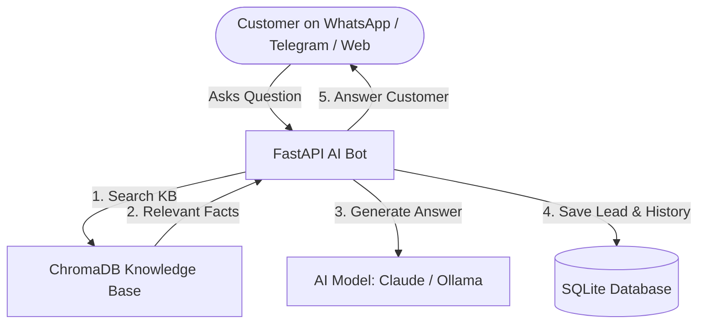

# 🤖 WhatsApp & Telegram AI Support Bot (RAG Starter Kit)

A production-ready, retrieval-augmented customer support assistant API built with **FastAPI**, **LangChain**, **ChromaDB**, and **Docker**. 

This starter kit automatically answers customer queries using your custom business knowledge base (FAQs, pricing, policy docs) while automatically capturing contact leads into a database.

---

## 📌 Table of Contents
- [🌟 Non-Technical Overview (Business Guide)](#-non-technical-overview-business-guide)
- [⚙️ Technical Architecture (Developer Guide)](#️-technical-architecture-developer-guide)
- [🚀 Quickstart Guide (Manual Setup & Docker)](#-quickstart-guide-manual-setup--docker)
- [📡 API Reference](#-api-reference)
- [🧪 Testing & Benchmarking](#-testing--benchmarking)
- [📁 Project Structure](#-project-structure)

---

## 🌟 Non-Technical Overview (Business Guide)

### What does this project do?
Imagine having an intelligent 24/7 customer support representative for your business on **WhatsApp**, **Telegram**, or your **Website**. This bot:
1. **Reads your business documents**: Knows your opening hours, pricing, services, emergency contacts, and store location.
2. **Gives accurate, truthful answers**: Uses **Retrieval-Augmented Generation (RAG)** to answer strictly from your provided knowledge base—eliminating hallucinated or false responses.
3. **Captures Customer Leads**: When a customer leaves their email, phone number, or appointment interest in chat, the bot automatically saves them as a sales lead in your database.
4. **Works Cloud or Offline**: Connects to cloud AI (Anthropic Claude) for highest quality, or runs 100% offline on your own server (via Ollama) for complete privacy.



---

## ⚙️ Technical Architecture (Developer Guide)

### Tech Stack
- **Framework**: FastAPI (Python 3.11) with Uvicorn ASGI server
- **Orchestration**: LangChain Core / LangChain Community
- **Vector Storage**: ChromaDB with `sentence-transformers/all-MiniLM-L6-v2` embeddings
- **LLM Providers**: Primary Anthropic Claude (`claude-sonnet-4-6`), with automatic local fallback to Ollama (`qwen2.5:7b`)
- **Database**: SQLite with SQLAlchemy ORM (tracks conversation history & lead collection)
- **Containerization**: Docker & Docker Compose

### Key Features
- **Auto-Seeding**: Automatically seeds initial FAQ content into ChromaDB on first startup if vector storage is empty.
- **Session-Based Context**: Automatically remembers previous chat turns per `session_id`.
- **Heuristic Lead Detection**: RegEx pattern matcher extracts emails and phone numbers from user messages and stores them in the `leads` table.
- **Fail-Safe Offline Mode**: Gracefully operates in dry-run/Ollama mode if external LLM API keys are unavailable.

---

## 🚀 Quickstart Guide (Manual Setup & Docker)

### Option A: Using Docker (Recommended)

#### Prerequisites
- Installed [Docker Desktop](https://www.docker.com/products/docker-desktop/)

#### 1. Clone the repository
```bash
git clone https://github.com/zeeshanqadir568/whatsapp-telegram-ai-support-bot.git
cd whatsapp-telegram-ai-support-bot
```

#### 2. Start the service
```bash
docker compose up --build -d
```

#### 3. Verify it is running
Open your browser and visit: **[http://localhost:8000/docs](http://localhost:8000/docs)**

---

### Option B: Local Python Installation

#### 1. Create a Python Virtual Environment
```bash
python -m venv venv
# On Windows PowerShell:
.\venv\Scripts\Activate.ps1
# On Linux/macOS:
source venv/bin/activate
```

#### 2. Install Dependencies
```bash
pip install -r requirements.txt
```

#### 3. Environment Configuration
Copy `.env.example` to `.env`:
```bash
cp .env.example .env
```
*(Optional: Add your `ANTHROPIC_API_KEY` to `.env` if you wish to use Claude)*

#### 4. Run the API Server
```bash
uvicorn app:app --reload --host 0.0.0.0 --port 8000
```

---

## 📡 API Reference

### 1. Health Check
- **Endpoint**: `GET /health`
- **Description**: Returns system status, active LLM provider, vector store document count, and database health.
- **Sample Request**:
```bash
curl http://localhost:8000/health
```
- **Sample Response**:
```json
{
  "status": "ok",
  "active_llm_provider": "ollama",
  "vector_store_documents": 2,
  "database_status": "healthy"
}
```

---

### 2. Chat Endpoint
- **Endpoint**: `POST /chat`
- **Description**: Submits a user query, searches knowledge base, generates an AI response, and saves lead information if detected.
- **Sample Request**:
```bash
curl -X POST http://localhost:8000/chat \
  -H "Content-Type: application/json" \
  -d '{
    "message": "What are your business hours? My email is user@example.com",
    "session_id": "session_123",
    "channel": "whatsapp"
  }'
```
- **Sample Response**:
```json
{
  "reply": "We are open Monday to Friday 9:00 AM - 6:00 PM, Saturday 10:00 AM - 3:00 PM.",
  "session_id": "session_123",
  "channel": "whatsapp",
  "sources": ["dental_clinic_faq.txt"],
  "lead_captured": true
}
```

---

## 🧪 Testing & Benchmarking

### Running Unit Tests
Run unit tests for API endpoints and RAG engine:
```bash
python -m unittest discover -s tests
```

### Retrieval Evaluation Benchmark
Measure RAG retrieval accuracy (Precision@K and Recall@K):
```bash
python eval_retrieval.py
```

---

## 📁 Project Structure

```
├── app.py                # FastAPI routes (/chat, /health) & startup seeding
├── rag_engine.py         # RAG core, ChromaDB manager, LLM fallback & lead extraction
├── database.py           # SQLAlchemy engine & session setup
├── models.py             # Database models (Conversation, Lead)
├── eval_retrieval.py     # Retrieval benchmark suite
├── requirements.txt      # Python dependencies
├── Dockerfile            # Production Docker image configuration
├── docker-compose.yml    # Docker Compose setup
├── .env.example          # Environment variables template
└── tests/                # Unit test suite
```

---

## 📝 License
This project is open-source and available under the **MIT License**.
