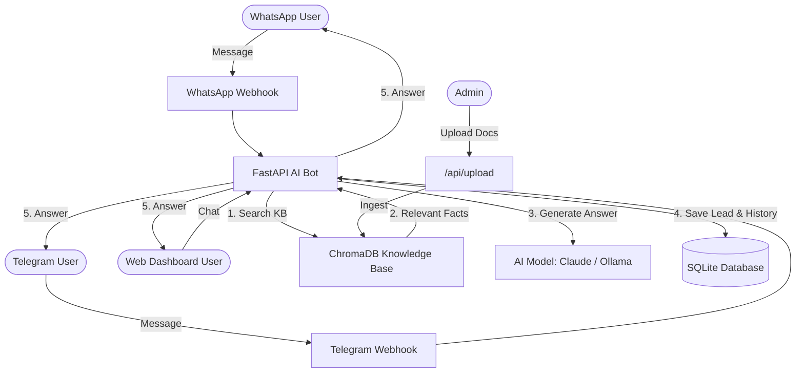

# 🤖 WhatsApp & Telegram AI Support Bot (RAG Starter Kit)

A production-ready, retrieval-augmented customer support assistant built with **FastAPI**, **LangChain**, **ChromaDB**, and **Docker**.

This bot automatically answers customer queries using your custom business knowledge base (FAQs, pricing, policy docs) while automatically capturing contact leads into a database. It integrates directly with **WhatsApp**, **Telegram**, and includes an interactive **Web Dashboard**.

---

## 📌 Table of Contents
- [🌟 Non-Technical Overview](#-non-technical-overview)
- [✨ Features](#-features)
- [⚙️ Technical Architecture](#️-technical-architecture)
- [🚀 Quickstart Guide](#-quickstart-guide)
- [🖥️ Web Dashboard](#️-web-dashboard)
- [📡 API Reference](#-api-reference)
- [🔗 Webhook Integration (WhatsApp & Telegram)](#-webhook-integration-whatsapp--telegram)
- [📤 Knowledge Base Upload](#-knowledge-base-upload)
- [🧪 Testing & Benchmarking](#-testing--benchmarking)
- [📁 Project Structure](#-project-structure)
- [📋 Development Log](#-development-log)

---

## 🌟 Non-Technical Overview

### What does this project do?
Imagine having an intelligent 24/7 customer support representative for your business on **WhatsApp**, **Telegram**, or your **Website**. This bot:

1. **Reads your business documents**: Knows your opening hours, pricing, services, emergency contacts, and store location.
2. **Gives accurate, truthful answers**: Uses **Retrieval-Augmented Generation (RAG)** to answer strictly from your provided knowledge base—eliminating hallucinated or false responses.
3. **Captures Customer Leads**: When a customer leaves their email, phone number, or appointment interest in chat, the bot automatically saves them as a sales lead in your database.
4. **Connects to WhatsApp & Telegram**: Real webhook endpoints that receive and reply to messages from both platforms automatically.
5. **Upload Your Own Documents**: Admin can upload PDFs, text files, or markdown documents through the web dashboard to expand the knowledge base.
6. **Works Cloud or Offline**: Connects to cloud AI (Anthropic Claude) for highest quality, or runs 100% offline on your own server (via Ollama) for complete privacy.



---

## ✨ Features

| Feature | Description |
|---------|-------------|
| 🧠 **RAG-Powered AI** | Answers from your knowledge base using ChromaDB vector search + LLM |
| 💬 **WhatsApp Integration** | Webhook endpoint for Meta Cloud API (receive & reply to messages) |
| 🤖 **Telegram Integration** | Webhook endpoint for Telegram Bot API (receive & reply to messages) |
| 🖥️ **Web Dashboard** | Interactive admin panel with chat simulator, leads viewer, and KB browser |
| 📤 **Document Upload** | Upload PDFs, TXT, or MD files to expand the knowledge base via API or UI |
| 📊 **Lead Capture** | Auto-extracts emails & phone numbers from conversations |
| 💾 **Session Memory** | Remembers previous chat turns per session for contextual responses |
| 🔄 **LLM Fallback** | Anthropic Claude (cloud) → Ollama (local) automatic failover |
| 🐳 **Docker Ready** | One-command deployment with Docker Compose |
| 🧪 **Test Suite** | Unit tests for API endpoints and RAG retrieval benchmarks |

---

## ⚙️ Technical Architecture

### Tech Stack
| Component | Technology |
|-----------|-----------|
| **Framework** | FastAPI (Python 3.11) with Uvicorn ASGI server |
| **AI Orchestration** | LangChain Core / LangChain Community |
| **Vector Storage** | ChromaDB with `sentence-transformers/all-MiniLM-L6-v2` embeddings |
| **LLM Providers** | Primary: Anthropic Claude (`claude-sonnet-4-6`), Fallback: Ollama (`qwen2.5:7b`) |
| **Database** | SQLite with SQLAlchemy ORM |
| **Frontend** | Vanilla HTML/CSS/JS (single-page dashboard) |
| **Containerization** | Docker & Docker Compose |
| **File Processing** | PyPDF for PDF extraction, built-in text/markdown support |

---

## 🚀 Quickstart Guide

### Option A: Using Docker (Recommended)

#### Prerequisites
- Installed [Docker Desktop](https://www.docker.com/products/docker-desktop/)

#### 1. Clone the repository
```bash
git clone https://github.com/zeeshanqadir568/whatsapp-telegram-ai-support-bot.git
cd whatsapp-telegram-ai-support-bot
```

#### 2. Configure environment
```bash
cp .env.example .env
# Edit .env and add your ANTHROPIC_API_KEY (optional — works without it using Ollama fallback)
```

#### 3. Start the service
```bash
docker compose up --build -d
```
> ⚠️ **First build takes 10-15 minutes** (downloads PyTorch, CUDA libraries, and AI models).

#### 4. Verify it is running
```bash
curl http://localhost:8000/health
```
Expected response:
```json
{
  "status": "ok",
  "active_llm_provider": "ollama",
  "vector_store_documents": 2,
  "database_status": "healthy"
}
```

#### 5. Open the Dashboard
Open your browser and visit: **[http://localhost:8000](http://localhost:8000)**

---

### Option B: Local Python Installation

#### 1. Create a Python Virtual Environment
```bash
python -m venv venv
# On Windows PowerShell:
.\venv\Scripts\Activate.ps1
# On Linux/macOS:
source venv/bin/activate
```

#### 2. Install Dependencies
```bash
pip install -r requirements.txt
```

#### 3. Environment Configuration
```bash
cp .env.example .env
```
*(Optional: Add your `ANTHROPIC_API_KEY` to `.env` if you wish to use Claude)*

#### 4. Run the API Server
```bash
uvicorn app:app --reload --host 0.0.0.0 --port 8000
```

---

## 🖥️ Web Dashboard

The built-in admin dashboard is available at `http://localhost:8000/` and includes three tabs:

### 💬 Chat Simulator
- Test the AI bot in real-time with a WhatsApp/Telegram-styled chat interface
- Quick suggestion buttons for common queries
- Shows source documents used to generate answers

### 📊 Sales Leads
- View all captured customer leads in a real-time table
- Displays name, email, phone, interest, and channel (WhatsApp/Telegram/Web)
- Auto-refreshes to show newly captured leads

### 📚 Knowledge Base
- Browse all documents currently loaded in ChromaDB
- **Upload new documents** (PDF, TXT, MD) directly from the UI
- Expands the bot's knowledge instantly after upload

---

## 📡 API Reference

### 1. Health Check
```
GET /health
```
Returns system status, active LLM provider, vector store document count, and database health.

**Response:**
```json
{
  "status": "ok",
  "active_llm_provider": "ollama",
  "vector_store_documents": 2,
  "database_status": "healthy"
}
```

---

### 2. Chat Endpoint
```
POST /chat
```
Submits a user query, searches the knowledge base, generates an AI response, and saves lead information if detected.

**Request Body:**
```json
{
  "message": "What are your business hours? My email is user@example.com",
  "session_id": "session_123",
  "channel": "whatsapp"
}
```

**Response:**
```json
{
  "reply": "We are open Monday to Friday 9:00 AM - 6:00 PM, Saturday 10:00 AM - 3:00 PM.",
  "session_id": "session_123",
  "channel": "whatsapp",
  "sources": ["dental_clinic_faq.txt"],
  "lead_captured": true
}
```

---

### 3. Get Leads
```
GET /api/leads
```
Returns all captured sales leads from the database.

---

### 4. Get Knowledge Base Documents
```
GET /api/knowledge-base
```
Returns all documents currently stored in ChromaDB.

---

### 5. Upload Document to Knowledge Base
```
POST /api/upload
```
Upload a PDF, TXT, or MD file to expand the bot's knowledge base.

**Request:** `multipart/form-data` with a `file` field.

**Response:**
```json
{
  "status": "success",
  "filename": "company_policy.pdf",
  "chunks_added": 5,
  "total_documents": 7
}
```

---

## 🔗 Webhook Integration (WhatsApp & Telegram)

### Telegram Webhook
```
POST /webhook/telegram
```
Receives Telegram Bot API update objects. The bot processes the message through RAG, logs the conversation, captures leads, and replies automatically via the Telegram API.

**Setup:**
1. Create a bot via [@BotFather](https://t.me/BotFather)
2. Add `TELEGRAM_BOT_TOKEN=your_token_here` to `.env`
3. Set your webhook URL with Telegram:
```bash
curl https://api.telegram.org/bot<YOUR_TOKEN>/setWebhook?url=https://your-domain.com/webhook/telegram
```

---

### WhatsApp Webhook
```
GET  /webhook/whatsapp   # Verification challenge (Meta Cloud API)
POST /webhook/whatsapp   # Incoming messages
```
Handles Meta Cloud API webhook verification and incoming WhatsApp messages.

**Setup:**
1. Create a Meta Business App at [developers.facebook.com](https://developers.facebook.com)
2. Add the following to `.env`:
```env
WHATSAPP_VERIFY_TOKEN=your_verify_token
WHATSAPP_ACCESS_TOKEN=your_access_token
WHATSAPP_PHONE_NUMBER_ID=your_phone_number_id
```
3. Set your webhook URL in the Meta Developer Console to `https://your-domain.com/webhook/whatsapp`

---

## 🧪 Testing & Benchmarking

### Running Unit Tests
```bash
python -m unittest discover -s tests
```

### Retrieval Evaluation Benchmark
Measure RAG retrieval accuracy (Precision@K and Recall@K):
```bash
python eval_retrieval.py
```

---

## 📁 Project Structure

```
├── app.py                  # FastAPI routes, webhooks, upload endpoint & startup seeding
├── rag_engine.py           # RAG core, ChromaDB manager, LLM fallback & lead extraction
├── database.py             # SQLAlchemy engine & session setup
├── models.py               # Database models (Conversation, Lead)
├── eval_retrieval.py       # Retrieval benchmark suite
├── requirements.txt        # Python dependencies
├── Dockerfile              # Production Docker image configuration
├── docker-compose.yml      # Docker Compose setup
├── .env.example            # Environment variables template
├── SESSION_LOG.md          # Development audit log
├── static/                 # Web Dashboard frontend
│   ├── index.html          # Dashboard HTML (chat, leads, knowledge base tabs)
│   ├── script.js           # Frontend logic (API calls, chat, upload)
│   └── style.css           # Dashboard styling (dark theme, responsive)
└── tests/                  # Unit test suite
    ├── __init__.py
    ├── test_app.py          # API endpoint tests
    └── test_rag_engine.py   # RAG engine tests
```

---

## 📋 Development Log

### Commit History

| Commit | Description |
|--------|-------------|
| `0534764` | **Initial commit**: WhatsApp & Telegram AI Support Bot starter kit with RAG Engine |
| `a6cda05` | **README**: Comprehensive docs with non-technical and developer guides |
| `47ffb83` | **Web Dashboard**: Interactive frontend with chat simulator & sales lead dashboard |
| `3a83947` | **Webhooks & Upload**: Telegram/WhatsApp webhook handlers + document upload endpoint |
| `a684739` | **Bug Fix**: Added `python-multipart` dependency, fixed `UploadFile`/`File` imports |
| `028ab65` | **Session Log**: Complete development audit with resume instructions |

---

## 🔑 Environment Variables

| Variable | Description | Required |
|----------|-------------|----------|
| `ANTHROPIC_API_KEY` | Anthropic Claude API key | Optional (falls back to Ollama) |
| `ANTHROPIC_MODEL` | Claude model name (default: `claude-sonnet-4-6`) | No |
| `OLLAMA_BASE_URL` | Ollama server URL (default: `http://localhost:11434`) | No |
| `OLLAMA_MODEL` | Ollama model name (default: `qwen2.5:7b`) | No |
| `TELEGRAM_BOT_TOKEN` | Telegram bot token from BotFather | For Telegram integration |
| `WHATSAPP_VERIFY_TOKEN` | Meta webhook verification token | For WhatsApp integration |
| `WHATSAPP_ACCESS_TOKEN` | Meta Cloud API access token | For WhatsApp integration |
| `WHATSAPP_PHONE_NUMBER_ID` | WhatsApp Business phone number ID | For WhatsApp integration |
| `CHROMA_PERSIST_DIR` | ChromaDB storage path (default: `./data/chroma`) | No |
| `DATABASE_URL` | SQLite connection string | No |

---

## 📝 License
This project is open-source and available under the **MIT License**.
